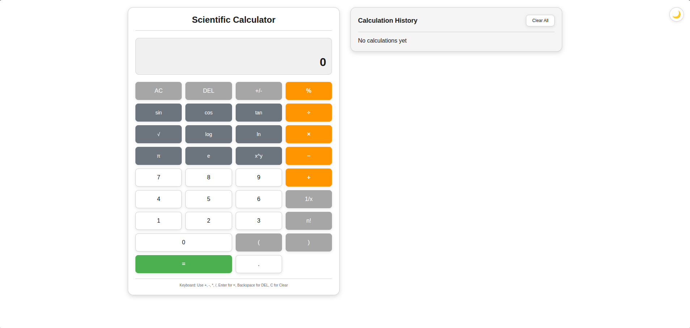
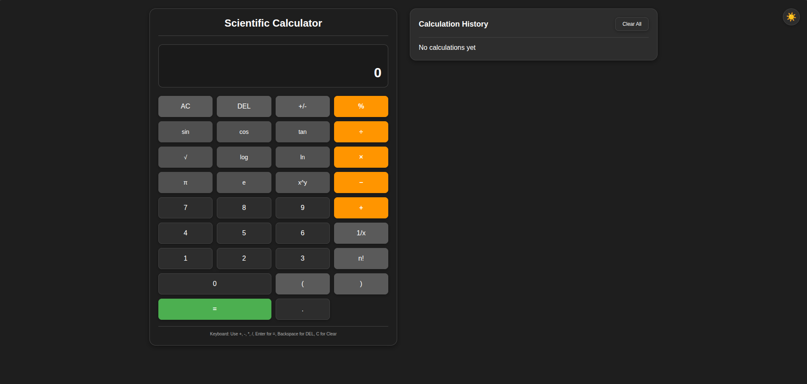
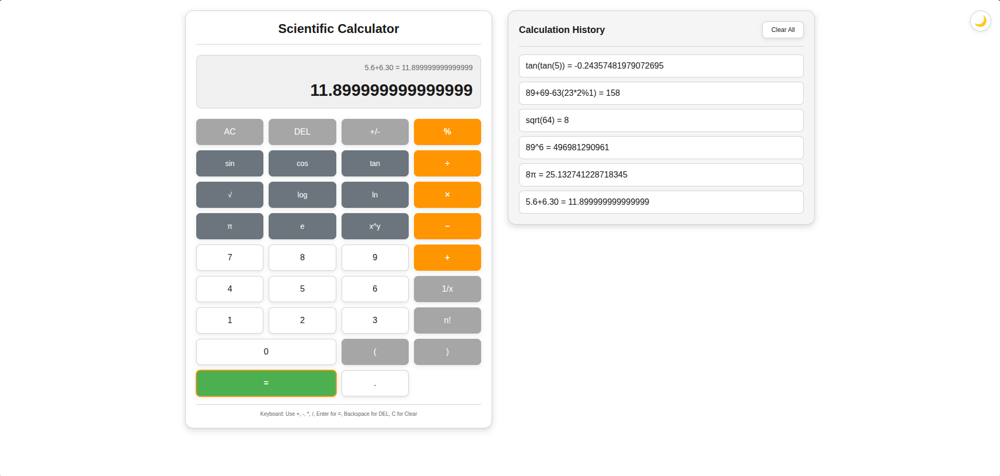

# 🧮 Scientific Calculator – Assessment Project

A fully modular, browser-based **Scientific Calculator** built using modern JavaScript (ES Modules). This project demonstrates strong understanding of advanced JavaScript concepts including **Closures, Classes, this binding, Modularity, and Error Handling**.

---

## 📑 Table of Contents

- Overview
- Features
- Technologies Used
- Folder Structure
- JavaScript Concepts Demonstrated
- How Expression Evaluation Works
- Error Handling
- How to Run
- License

---

# 📌 Overview

This Scientific Calculator is built with a focus on:

- Modular ES6 architecture
- Clean, maintainable JavaScript
- Robust expression evaluation (no eval)
- UI/UX responsiveness

It supports both **basic arithmetic** and **advanced scientific functions**.

---

# 🌟 Features

## 🔢 Basic Operations

- Addition (+)
- Subtraction (−)
- Multiplication (×)
- Division (÷)
- Modulus (%)
- Evaluate (=)

## 🔬 Scientific Functions

- sin(x), cos(x), tan(x)
- log(x), ln(x)
- sqrt(x)
- x^y (power)
- π, e
- Factorial

## 🖥 UI Features

- Responsive interface
- Expression & result display
- History panel
- Clear History
- Light/Dark theme toggle
- Keyboard support
- Localstorage persistence

---

# ⌨️ Keyboard Support

The calculator includes full keyboard support for faster and more convenient input.
The following keys are supported:

## 🔢 Number Keys (0–9)

All numeric keys can be used directly to enter numbers.

## ➕ Operators

The following operator keys work as expected:

- \+ (Addition)
- \- (Subtraction)
- \* (Multiplication)
- / (Division)
- % (Modulus)

## ↩️ Backspace

Backspace key deletes the last character from the current expression.

## 🧹 Clear Input

Press C or c to clear the entire input instantly.

## ✔️ Evaluate Expression

Press Enter to evaluate the current expression.

# 🧰 Technologies Used

- HTML5
- CSS3
- JavaScript (ES Modules)

---

# 🗂 Folder Structure

```
/ (project root)
├─ index.html
├─ css/
│  └─ style.css
└─ js/
   ├─ script.js
   └─ utils/
       ├─ calculator.js
       ├─ infixToPostfix.js
       ├─ operations.js
       ├─ postfixEvaluation.js
       ├─ stack.js
       └─ tokenizer.js
```

---

# 🧠 JavaScript Concepts Demonstrated

### 🔒 Closures

Used for private calculator state and history.

### 🏛 Classes

The Calculator class manages evaluation, history, scientific operations, and error handling.

### 🎯 Proper Use of `this`

Correct handling in class methods and DOM event binding.

### 🧩 Modularity

Each module focuses on a single responsibility.

---

# ⚙️ Expression Evaluation Workflow

```
Infix Input → Tokenizer → Shunting Yard (Infix → Postfix) → Postfix Evaluation → Result
```

# 🔁 Shunting Yard Algorithm

The **Shunting Yard Algorithm** converts an **infix expression** (human-readable format) into **postfix notation (Reverse Polish Notation)**, which is easier to evaluate using a stack.

Example:

Infix:   3 + 4 * 2  
Postfix: 3 4 2 * +

---

## ⚙️ How It Works (Simplified)

The algorithm uses:

- Output Queue  
- Operator Stack  

Rules:

1. Numbers → go directly to output.
2. Operators → pushed to stack (respecting precedence).
3. `(` → pushed to stack.
4. `)` → pop operators until `(` is found.
5. After processing all tokens → pop remaining operators to output.

---

## 📊 Operator Precedence

| Operator | Precedence | Associativity |
|----------|------------|---------------|
| !        | Highest    | Right         |
| ^        | High       | Right         |
| *, /, %  | Medium     | Left          |
| +, −     | Low        | Left          |

---

## 🧪 Example with Parentheses

Infix:   (3 + 4) * 2  
Postfix: 3 4 + 2 *

---

## 🧠 Why Use It?

- Handles operator precedence correctly  
- Supports parentheses  
- Avoids using `eval()`  
- Enables safe stack-based evaluation  

**Time Complexity:** O(n)
---

# 🛡 Error Handling

The calculator safely handles:

- Division by zero
- Invalid expressions
- Malformed input
- Scientific domain errors

---

## Installation

Follow the steps below to run the project locally.

### Clone the repository

Replace `<repo-url>` with the actual repository URL:

```bash
git clone https://github.com/ronaksharma-simform/calculator_assessment
```

Navigate into the project directory
cd calculator_assessment

Open the project in your browser

Open index.html using the command for your operating system:

### macOS

```bash
open index.html
```

### Linux

```bash
open index.html
```

### Windows (PowerShell)

```powershell
start index.html
```

### Open with Live Server (recommended)

- VS Code: Install the "Live Server" extension, open the project folder, right-click `index.html` → "Open with Live Server" (or click "Go Live" in the status bar).
- Open the provided URL (usually http://127.0.0.1:5500 or http://127.0.0.1:8080) in your browser.

## Screenshots

### Light theme.



### Dark theme.



### History panel.



## 📌 Key Takeaways

This project demonstrates:

- Advanced understanding of expression parsing
- Data structure implementation (Stack)
- Algorithm implementation (Shunting Yard)
- Modular ES6 architecture
- Clean error handling strategy
- DOM event management
- Local storage state persistence

## Contributing

Contributions are welcome! You can:

- Fork the repository

- Create a new branch (git checkout -b feature/your-feature)
- Commit your changes (git commit -m "Add feature")

- Push to the branch (git push origin feature/your-feature)

- Open a Pull Request

## License

This project is for assessment purposes. Modify and use as needed.
